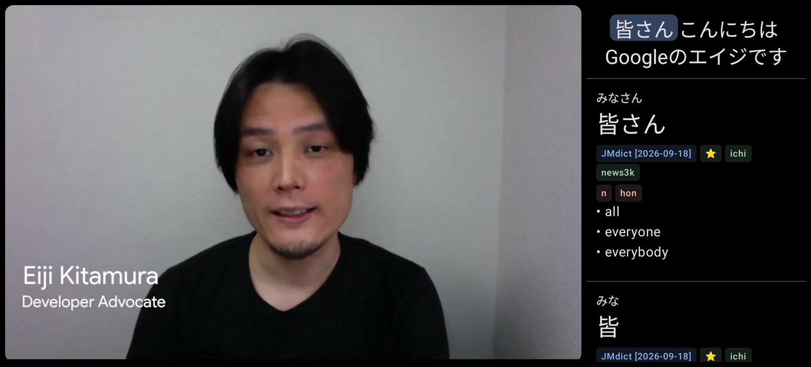
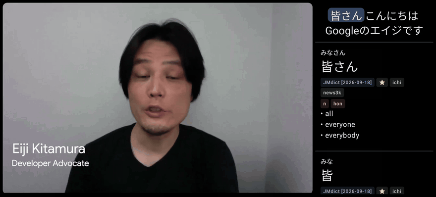
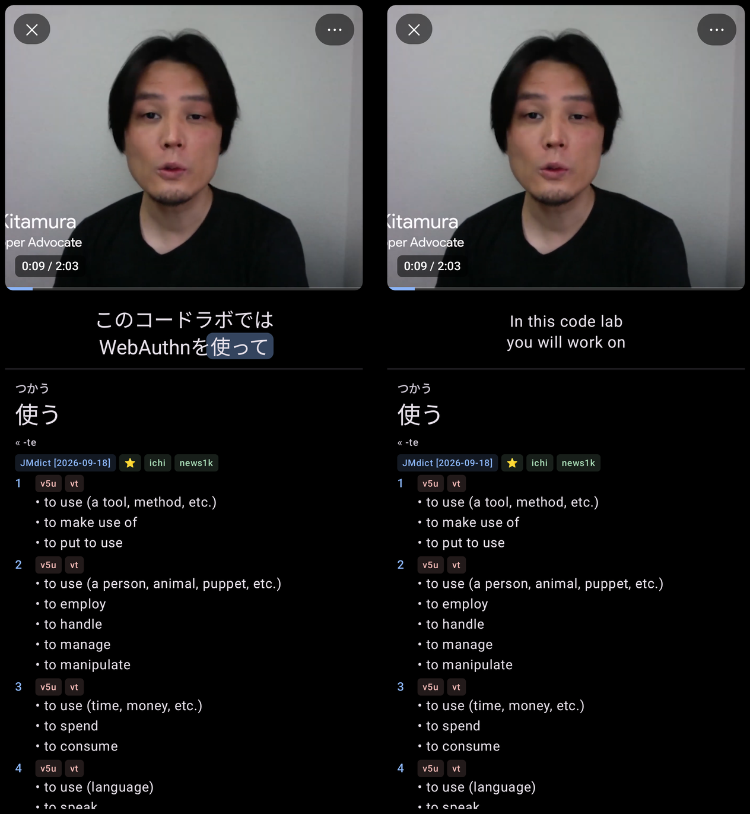
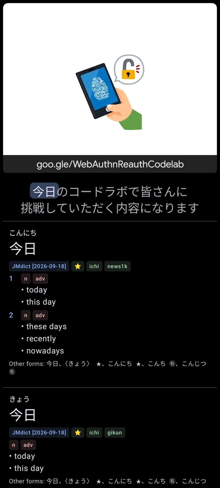
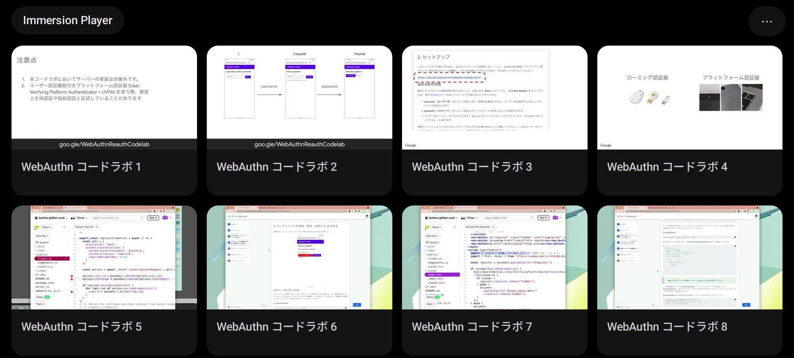

# Immersion Player

**A Japanese video player where the subtitle line is the interface.**

[](LICENSE)




On a desktop you can do this already: mpv on one side, a clipboard bridge, Yomitan or Rikaitan
open on the other, and every line of dialogue one keypress away. On a phone you get a player
that hides the subtitles behind a menu and a dictionary app you have to paste into.

This is the desktop loop, rebuilt for a touchscreen. The video plays on the left. The current
line sits on the right with a word already looked up. Tap another word, drag across a phrase,
hold to see the English, swipe to step back a line and hear it again.



## No buttons

There is no transport bar, no menu strip, no overlay that appears when you touch the screen and
covers the thing you were reading. Every action is a gesture, and the app tells you all of them
once, on first run.

| Where | Gesture | Does |
|---|---|---|
| Video | tap | play / pause |
| Video | double-tap left or right edge | −5 s / +5 s, and keep tapping to stack |
| Video | drag sideways | scrub — move up or down mid-drag to scrub faster |
| Video | pinch | fill the area, or fit the whole picture |
| Video (paused) | tap or drag the bottom line | seek |
| Line | tap a word | look it up |
| Line | drag across the text | look up exactly what you selected |
| Line | hold | show the English translation |
| Panel | swipe sideways | previous / next line |
| Panel | tap | play / pause |
| Panel | double-tap | stop at the end of every line, on or off |
| Divider | drag | resize the video and the panel |
| Shoulder triggers | press | previous / next line (RedMagic, see below) |

Hold anywhere on the panel and the Japanese is replaced, in place, by the translation:



Turn the phone and the same layout stacks instead of splitting. The video keeps a share of the
height you chose; the panel takes the rest.



## Always a word defined

An empty dictionary pane is a wasted pane. Every time the line changes the app looks something
up by itself — the first kanji it can find, skipping speaker names and the readings in brackets
that subtitle files are full of, falling through to the next candidate until a lookup hits.

Lookups take the longest match at the position you touched and undo conjugation to get there, so
食べさせられなかった finds 食べる, and the entry shows you the chain it followed.

Dictionaries are Yomitan's: the same zips Yomitan and Rikaitan take, including term banks,
frequency lists and pitch accent, imported into SQLite and searched locally. JMdict is bundled
and installs itself the first time you open the app, so there is nothing to set up. Structured
content renders rather than being flattened to a string.

## Plays the files you actually have

Playback is libmpv, from [mpv-android](https://github.com/mpv-android/mpv-android)'s prebuilt
binaries. This is not a preference. A large share of Japanese releases are 10-bit H.264, which
Android's hardware decoders do not support and its software decoder declines; a stock
`MediaCodec` player shows you a black rectangle. mpv decodes them, and — because it is already
there — also generates the library thumbnails, headless, straight to a bitmap.

Subtitles come out of the container rather than through the player: the app walks the Matroska
EBML itself, handles zlib-compressed tracks, and parses SRT, ASS/SSA and WebVTT. Sidecar files
next to the video win over embedded tracks when they exist. Extraction is cached per file, so
you pay for it once.



The library groups a folder of shows, orders episodes the way a human would rather than the way
`strcmp` would, remembers where you stopped, and offers the next episode when one ends. It will
also open a video handed to it by another app.

## Shoulder triggers, the hard way

The RedMagic 10 Pro has two capacitive shoulder triggers. They report `KEY_F7` and `KEY_F8`,
which sounds like the end of the story, except:

1. The sensors are unpowered unless Nubia's game settings are on.
2. Nubia's game service consumes both key events before any app sees them. Watching the raw
   input devices during a press produced hundreds of events and not one of them reached us.

So the app skips the input stack entirely. With [Shizuku](https://shizuku.rikka.app/) running it
starts a small user service at shell privilege for as long as a video is open: it turns the
sensors on, re-applies the setting every second because Nubia keeps turning it back off, and
reads the two device nodes with `getevent` directly. Leave the player and the settings are put
back the way they were.

It is off by default and lives in the advanced section, where the same panel tells you what
Shizuku still needs and lets you test both triggers live. Shizuku stops on every reboot and has
to be started again; the app's permission survives. Nothing else in the app needs it.

The approach was worked out first by [RedTrigger](https://github.com/zampierilucas/RedTrigger).

## Install

No build is published yet — APKs will land on the
[releases page](https://github.com/finchett/Immersion-Player/releases). Until then:

```sh
./scripts/fetch-libmpv.sh          # pinned mpv-android release, extracts its native libs
echo "sdk.dir=$HOME/Library/Android/sdk" > local.properties
./gradlew :app:assembleDebug
adb install -r app/build/outputs/apk/debug/app-debug.apk
```

Needs JDK 17, Android SDK platform 36, and an arm64 device on Android 11 or newer.

The native libraries are not committed. `app/src/main/java/is/xyz/mpv/MPVLib.kt` is vendored
unchanged from the same mpv-android tag, because the prebuilt `libplayer.so` binds to that exact
class — keep the two in step when you update either.

## Tests

```sh
./gradlew :app:testDebugUnitTest
```

The Matroska test checks extraction against reference files produced by ffmpeg, and skips itself
unless you point it at a real episode:

```sh
IMMERSION_TEST_MKV=episode.mkv \
IMMERSION_TEST_JA_SRT=episode.ja.srt \  # ffmpeg -i episode.mkv -map 0:s:<ja> episode.ja.srt
IMMERSION_TEST_EN_ASS=episode.en.ass \  # ffmpeg -i episode.mkv -map 0:s:<en> -c:s copy episode.en.ass
./gradlew :app:testDebugUnitTest
```

## Debugging

Some phones quietly disable logcat for third-party apps, so crashes go to `files/last_crash.txt`
and lookup failures to `files/errors.log`:

```sh
adb shell run-as io.github.immersionplayer cat files/last_crash.txt
```

## Layout

```
app/src/main/java/io/github/immersionplayer/
  player/      MpvView (libmpv surface), PlayerSession (playback state, line stepping)
  subs/        SRT/ASS parsers, Matroska extractor, subtitle loading and caching
  dictionary/  Yomitan importer, SQLite store, deinflector, lookup, bundled dictionaries
  triggers/    Shizuku user service for the RedMagic shoulder buttons
  mining/      card model and store for Anki export
  ui/          library, player, dictionary panel, settings
```

## Not there yet

Anki export has a card model and a store behind it but no UI, so nothing leaves the app today.
Sidecar subtitle files can't be found for videos opened from another app, because a content URI
doesn't tell you what's next to it. Builds are arm64 only. The layout assumes a phone.

## Licence

Immersion Player is free software under the **GNU General Public License v3.0 or later**
(see [LICENSE](LICENSE)). That follows from the mpv and FFmpeg binaries it bundles. You may use,
modify, sell and redistribute it, provided recipients get the same freedoms and the source.

- **JMdict** (bundled): © Electronic Dictionary Research and Development Group, under
  [CC BY-SA 4.0](https://www.edrdg.org/edrdg/licence.html). Yomitan conversion by
  [rikaitan-import](https://github.com/Ajatt-Tools/rikaitan-import).
- **mpv-android** (`MPVLib.kt`, JNI glue): MIT.
- **libmpv and FFmpeg** (prebuilt, fetched by `scripts/fetch-libmpv.sh`): GPL-2.0+/LGPL-2.1+ as
  built by mpv-android. These are why this app is GPL.
- **Shizuku API** (optional, for the shoulder triggers): Apache-2.0.

The footage in the screenshots is
[Build your first WebAuthn app](https://www.youtube.com/watch?v=8ren54IMSf4) by Eiji Kitamura for
Chrome for Developers, used under CC BY 3.0, with its own Japanese and English subtitle tracks.
